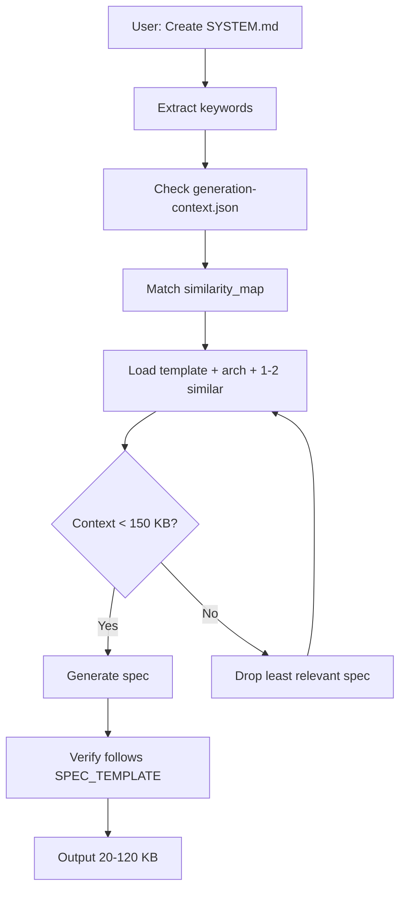

# EWH Platform - Agent Coordination Guardrails

> **Sistema di regole e vincoli per coordinare il lavoro di agenti AI multipli sulla codebase**

**Versione:** 1.0.0
**Ultimo aggiornamento:** 2025-10-04
**Applicabile a:** Tutti gli agenti AI che operano su questo progetto

---

## 📋 Indice

1. [Principi Fondamentali](#principi-fondamentali)
2. [Regole Obbligatorie](#regole-obbligatorie)
3. [Workflow di Lavoro](#workflow-di-lavoro)
4. [Coordinamento Multi-Agent](#coordinamento-multi-agent)
5. [Gestione Conflitti](#gestione-conflitti)
6. [Ottimizzazione Token](#ottimizzazione-token)

---

## Principi Fondamentali

### 1. **Single Source of Truth**

Ogni agente DEVE consultare questi documenti prima di iniziare qualsiasi lavoro:

1. **[PROJECT_STATUS.md](PROJECT_STATUS.md)** - Stato attuale di TUTTI i servizi
2. **[ARCHITECTURE.md](ARCHITECTURE.md)** - Architettura complessiva del sistema
3. **[CONTEXT_INDEX.md](CONTEXT_INDEX.md)** - Indice rapido per trovare informazioni
4. **[MASTER_PROMPT.md](MASTER_PROMPT.md)** - Istruzioni universali per agenti

**❌ VIETATO:**
- Assumere che un servizio sia implementato senza verificare PROJECT_STATUS.md
- Creare nuove funzionalità senza consultare ARCHITECTURE.md
- Duplicare codice esistente perché "non trovato"

### 2. **Read First, Write Later**

Prima di scrivere codice, ogni agente DEVE:

1. ✅ Leggere PROJECT_STATUS.md per capire lo stato del servizio
2. ✅ Leggere il file PROMPT.md del servizio specifico
3. ✅ Verificare dipendenze da altri servizi
4. ✅ Controllare se esistono test da aggiornare
5. ✅ Verificare che la feature non sia già implementata altrove

**Tempo minimo di lettura:** 5 minuti di analisi prima di ogni modifica

### 3. **Fail Fast, Document Always**

Se un agente scopre:
- ❌ Dipendenza non implementata → BLOCCARE e documentare in PROJECT_STATUS.md
- ❌ Conflitto architetturale → STOP e chiedere chiarimenti
- ❌ Test mancanti per area critica → CREARE test prima della feature

**❌ MAI:**
- Implementare workaround senza documentare il problema
- Ignorare dipendenze mancanti e "simulare" comportamento
- Procedere con modifiche breaking senza approval

---

## Regole Obbligatorie

### 🔒 Regola 1: Verifica Stato Servizio

Prima di modificare un servizio, verificare in [PROJECT_STATUS.md](PROJECT_STATUS.md):

```typescript
// BUONO ✅
// Leggo PROJECT_STATUS.md → svc-media è "SCAFFOLDING ONLY"
// Quindi so che devo implementare da zero

// CATTIVO ❌
// Assumo che svc-media funzioni
// Scrivo codice che dipende da endpoint non implementati
```

**Workflow:**
1. Apri PROJECT_STATUS.md
2. Cerca il servizio nella categoria appropriata
3. Leggi lo stato: ✅ Completo, 🚧 In Corso, 📝 Scaffold, ❌ Non Iniziato
4. Leggi "Features Implementate" e "Features Mancanti"
5. Verifica dipendenze nella sezione "Dipendenze tra Servizi"

### 🔒 Regola 2: Rispetta Convenzioni Tech Stack

**Backend (Microservizi):**
```typescript
// ✅ SEMPRE usare questo stack
import Fastify from 'fastify'
import { z } from 'zod'
import type { FastifyRequest, FastifyReply } from 'fastify'

// ❌ MAI usare Express, Koa, Hapi
// ❌ MAI usare Joi, Yup per validation
// ❌ MAI usare Class Validator
```

**Frontend (Apps):**
```typescript
// ✅ SEMPRE Next.js 14 con App Router
// ✅ SEMPRE React 18 con hooks
// ✅ SEMPRE TailwindCSS per styling

// ❌ MAI usare Pages Router
// ❌ MAI usare CSS-in-JS (styled-components, emotion)
// ❌ MAI usare class components
```

**Database:**
```sql
-- ✅ SEMPRE PostgreSQL con migrations
-- ✅ SEMPRE RLS policies per multi-tenancy
-- ✅ SEMPRE timestamps (created_at, updated_at)

-- ❌ MAI usare ORM (Prisma, TypeORM)
-- ❌ MAI fare query raw senza prepared statements
-- ❌ MAI dimenticare tenant_id nelle tabelle
```

### 🔒 Regola 3: Multi-Tenancy Obbligatorio

**OGNI servizio DEVE:**

```typescript
// ✅ Validare tenant_id in OGNI request
app.addHook('onRequest', async (req, rep) => {
  const { tenant_id } = req.authContext
  if (!tenant_id) {
    return rep.code(401).send({ error: 'Unauthorized' })
  }
})

// ✅ Includere tenant_id in OGNI query
const result = await db.query(
  'SELECT * FROM orders WHERE tenant_id = $1 AND id = $2',
  [tenant_id, order_id]
)

// ❌ MAI fare query senza tenant_id
const result = await db.query('SELECT * FROM orders WHERE id = $1', [order_id])
```

**Database Schema:**
```sql
-- ✅ OGNI tabella DEVE avere tenant_id
CREATE TABLE orders (
  id UUID PRIMARY KEY DEFAULT gen_random_uuid(),
  tenant_id UUID NOT NULL REFERENCES auth.organizations(id),
  -- altri campi...
  created_at TIMESTAMPTZ DEFAULT NOW(),
  updated_at TIMESTAMPTZ DEFAULT NOW()
);

-- ✅ RLS policy OBBLIGATORIA
ALTER TABLE orders ENABLE ROW LEVEL SECURITY;
CREATE POLICY tenant_isolation ON orders
  USING (tenant_id = current_setting('app.current_tenant')::UUID);

-- ✅ Index su tenant_id OBBLIGATORIO
CREATE INDEX idx_orders_tenant_id ON orders(tenant_id);
```

### 🔒 Regola 4: Error Handling Uniforme

```typescript
// ✅ SEMPRE usare questo formato
try {
  // business logic
} catch (error) {
  req.log.error({ error, context: { tenant_id, user_id } }, 'Operation failed')

  if (error instanceof ValidationError) {
    return rep.code(400).send({
      error: 'Validation failed',
      details: error.details
    })
  }

  if (error instanceof NotFoundError) {
    return rep.code(404).send({ error: 'Resource not found' })
  }

  // Generic 500 per errori non gestiti
  return rep.code(500).send({
    error: 'Internal server error',
    correlation_id: req.headers['x-correlation-id']
  })
}

// ❌ MAI lanciare errori non gestiti
// ❌ MAI esporre stack trace in produzione
// ❌ MAI restituire errori senza correlation ID
```

### 🔒 Regola 5: API Versioning

```typescript
// ✅ SEMPRE prefissare con /api/v1
app.get('/api/v1/orders', async (req, rep) => {
  // handler
})

// ✅ Per nuove major version, creare /api/v2
app.get('/api/v2/orders', async (req, rep) => {
  // breaking changes ok qui
})

// ❌ MAI fare breaking changes su v1 esistenti
// ❌ MAI rimuovere endpoint senza deprecation notice
```

### 🔒 Regola 6: Logging Strutturato

```typescript
// ✅ SEMPRE usare Pino structured logging
req.log.info({
  event: 'order.created',
  order_id,
  tenant_id,
  user_id,
  amount: order.total
}, 'Order created successfully')

// ✅ Livelli appropriati
req.log.debug({ query_params }, 'Processing request') // sviluppo
req.log.info({ order_id }, 'Order created') // operazioni normali
req.log.warn({ tenant_id }, 'Rate limit approaching') // warning
req.log.error({ error }, 'Operation failed') // errori

// ❌ MAI usare console.log
// ❌ MAI loggare dati sensibili (password, JWT, credit cards)
```

### 🔒 Regola 7: Testing Requirements

```typescript
// ✅ OGNI endpoint DEVE avere test
describe('POST /api/v1/orders', () => {
  it('should create order with valid data', async () => {
    const response = await app.inject({
      method: 'POST',
      url: '/api/v1/orders',
      headers: { Authorization: `Bearer ${token}` },
      payload: validOrderData
    })
    expect(response.statusCode).toBe(201)
  })

  it('should reject order without tenant isolation', async () => {
    // test tenant isolation
  })

  it('should validate required fields', async () => {
    // test validation
  })
})

// ✅ Coverage minimo: 60%
// ✅ Test DEVONO passare prima di merge
// ❌ MAI skippare test con .skip() in production code
```

---

## Workflow di Lavoro

### Fase 1: Analisi (OBBLIGATORIA)

**Tempo stimato:** 5-10 minuti

**Checklist:**
- [ ] Leggere [PROJECT_STATUS.md](PROJECT_STATUS.md) per stato servizio
- [ ] Leggere [ARCHITECTURE.md](ARCHITECTURE.md) per capire architettura
- [ ] Verificare [CONTEXT_INDEX.md](CONTEXT_INDEX.md) per riferimenti rapidi
- [ ] Leggere `{service}/PROMPT.md` per istruzioni specifiche
- [ ] Controllare dipendenze da altri servizi
- [ ] Verificare che feature non sia già implementata

**Output:** Documento di design (anche solo 5 righe in commento)

```typescript
/**
 * DESIGN: Implementazione svc-orders endpoint POST /api/v1/orders
 *
 * Dipendenze verificate:
 * - ✅ svc-auth: JWT validation (implementato)
 * - ❌ svc-products: Product validation (SCAFFOLDING - BLOCCANTE)
 * - ❌ svc-inventory: Stock check (SCAFFOLDING - BLOCCANTE)
 * - ❌ svc-billing: Payment intent (SCAFFOLDING - BLOCCANTE)
 *
 * Decisione: BLOCCARE implementazione fino a dipendenze pronte
 * Alternative: Implementare con mock data + TODO comments
 */
```

### Fase 2: Implementazione

**Regole:**

1. **Commits atomici:** 1 feature = 1 commit
2. **Branch naming:** `feature/svc-orders-create-endpoint`
3. **Commit messages:** Conventional Commits format

```bash
# ✅ BUONO
feat(svc-orders): implement POST /api/v1/orders endpoint

- Add order creation with validation
- Integrate with svc-products for product validation
- Add tenant isolation with RLS policy
- Add unit tests with 75% coverage

Refs: #123

# ❌ CATTIVO
"implemented orders"
```

4. **Pull Request Template:**

```markdown
## Description
Implementa endpoint POST /api/v1/orders per creazione ordini.

## Changes
- [x] Endpoint implementation
- [x] Input validation con Zod
- [x] Tenant isolation
- [x] Unit tests (75% coverage)
- [x] Integration tests
- [x] Documentation update

## Dependencies
- ✅ svc-products (verified working)
- ✅ svc-inventory (verified working)
- ⚠️ svc-billing (mocked for now, TODO: #124)

## Testing
- [x] Unit tests pass
- [x] Integration tests pass
- [x] Manual testing completed
- [x] Tested multi-tenant isolation

## Breaking Changes
None

## Checklist
- [x] PROJECT_STATUS.md updated
- [x] ARCHITECTURE.md updated (if needed)
- [x] Tests written and passing
- [x] No console.log left
- [x] No TODO without issue reference
```

### Fase 3: Documentazione (OBBLIGATORIA)

**Dopo OGNI modifica, aggiornare:**

1. **PROJECT_STATUS.md** - Spostare feature da "Mancanti" a "Implementate"
2. **Service README.md** - Aggiungere esempi di uso
3. **Service PROMPT.md** - Aggiornare stato per prossimi agenti
4. **CHANGELOG.md** (se esiste) - Loggare modifiche

```bash
# Script per update documentazione
./scripts/update-docs.sh svc-orders "Implemented POST /api/v1/orders"
```

---

## Coordinamento Multi-Agent

### Scenario 1: Due Agenti Stesso Servizio

**Problema:** Agent A e Agent B vogliono modificare svc-orders contemporaneamente

**Soluzione:**

1. **Lock File:** Creare `svc-orders/.LOCK_{agent_id}`
   ```bash
   # Agent A
   touch svc-orders/.LOCK_agent-a
   # Lavora...
   rm svc-orders/.LOCK_agent-a
   ```

2. **Status Check:** Verificare assenza lock prima di iniziare
   ```bash
   if [ -f svc-orders/.LOCK_* ]; then
     echo "Service locked by another agent, waiting..."
     exit 1
   fi
   ```

3. **Merge Strategy:** First-come, first-served
   - Agent A committa per primo → accepted
   - Agent B deve rebase su modifiche di A

### Scenario 2: Dipendenze Cross-Service

**Problema:** Agent A lavora su svc-orders, Agent B su svc-products (dipendenza)

**Soluzione:**

1. **Declare Intent:** Comunicare in PROJECT_STATUS.md
   ```markdown
   ## 🚧 Work in Progress

   - **svc-orders** (Agent A) - Implementing order creation
     - ETA: 2025-10-05
     - Blocks: svc-shipping

   - **svc-products** (Agent B) - Adding product variants
     - ETA: 2025-10-04
     - Blocks: svc-orders
   ```

2. **Dependency Wait:** Agent A attende completion di Agent B
3. **Mock Data:** Agent A può procedere con mock se urgente
   ```typescript
   // TODO(@agent-b): Replace with real svc-products call when ready
   // Tracked in: PROJECT_STATUS.md - svc-products "Add variants API"
   const product = MOCK_PRODUCT_RESPONSE
   ```

### Scenario 3: Conflitti Architetturali

**Problema:** Agent A vuole usare REST, Agent B vuole GraphQL

**Soluzione:**

1. **Escalate to ARCHITECTURE.md:** Non decidere autonomamente
2. **Create ADR (Architecture Decision Record):**
   ```markdown
   # ADR 001: API Style for svc-orders

   ## Context
   Agent A proposes REST, Agent B proposes GraphQL

   ## Decision
   Use REST for v1 (consistency with existing services)
   GraphQL considered for v2 (federation roadmap)

   ## Consequences
   - ✅ Consistent with svc-auth, svc-products
   - ❌ No batching queries (acceptable for v1)
   ```

3. **Document in GUARDRAILS.md:** Aggiornare questo file con decisione

---

## Gestione Conflitti

### Merge Conflicts

**Processo:**

1. **Pull latest:** Sempre fare pull prima di committare
   ```bash
   git pull origin main --rebase
   ```

2. **Resolve conflicts:** Preferire versione più recente se dubbio
   ```bash
   # In caso di dubbio, contattare autore originale
   git log --oneline {file_path}
   ```

3. **Test after merge:** SEMPRE girare test dopo merge
   ```bash
   npm test
   ```

### Breaking Changes

**Se DEVI fare breaking change:**

1. **Versioning:** Creare v2 endpoint, mantenere v1
   ```typescript
   // v1 - deprecated ma funzionante
   app.get('/api/v1/orders', oldHandler)

   // v2 - nuovo comportamento
   app.get('/api/v2/orders', newHandler)
   ```

2. **Deprecation Notice:** Aggiungere header
   ```typescript
   rep.header('Warning', '299 - "API v1 deprecated, use v2"')
   ```

3. **Migration Guide:** Documentare in README.md
   ```markdown
   ## Migration v1 → v2

   **v1 (deprecated):**
   ```json
   GET /api/v1/orders
   Response: { orders: [...] }
   ```

   **v2 (current):**
   ```json
   GET /api/v2/orders
   Response: {
     data: [...],
     meta: { total, page }
   }
   ```
   ```

### Rollback Procedure

**Se deploy rompe produzione:**

1. **Immediate Revert:**
   ```bash
   git revert {commit_hash}
   git push origin main
   ```

2. **Document Incident:**
   ```markdown
   # Incident Report 2025-10-04

   ## Issue
   Deploy of svc-orders broke order creation

   ## Root Cause
   Missing tenant_id validation

   ## Resolution
   Reverted commit abc123, added validation, redeployed

   ## Prevention
   Add test for tenant isolation (done)
   ```

---

## Ottimizzazione Token

### Strategia Caching

**Obiettivo:** Ridurre lettura ripetuta di file grandi

**Implementazione:**

1. **Context File:** Creare `.ai/context.json`
   ```json
   {
     "version": "1.0.0",
     "last_updated": "2025-10-04",
     "services": {
       "svc-auth": {
         "status": "complete",
         "endpoints": 12,
         "last_change": "2025-09-24"
       },
       "svc-orders": {
         "status": "scaffolding",
         "endpoints": 1,
         "last_change": "2025-10-04"
       }
     },
     "priority_services": [
       "svc-media",
       "svc-comm",
       "svc-timesheet"
     ]
   }
   ```

2. **Smart Loading:** Leggere solo context.json prima di file completi
   ```typescript
   // Agent workflow
   const context = await readFile('.ai/context.json')

   if (context.services['svc-orders'].status === 'scaffolding') {
     // Servizio scaffold → non leggere implementazione, vai diretto
   } else {
     // Servizio implementato → leggi codice
     await readFile('svc-orders/src/routes/orders.ts')
   }
   ```

3. **Incremental Updates:** Aggiornare context.json ad ogni modifica
   ```bash
   # Post-commit hook
   ./scripts/update-context.sh
   ```

### Tecniche Riduzione Token

**1. Index-First Approach:**
```markdown
# CONTEXT_INDEX.md (400 righe)
Leggere questo file PRIMA di PROJECT_STATUS.md (5000+ righe)
```

**2. Service PROMPT.md:**
Ogni servizio ha file sintetico (100-200 righe) invece di leggere tutto il codice

**3. Diff-Only Reading:**
```bash
# Invece di leggere tutto il file:
git diff HEAD~1 svc-orders/src/routes/orders.ts

# Leggere solo le modifiche recenti
```

**4. Lazy Loading:**
```typescript
// ❌ EVITARE: Leggere tutto subito
const allServices = await Promise.all(
  services.map(s => readFile(`${s}/README.md`))
)

// ✅ PREFERIRE: Leggere on-demand
const service = userRequest.service
const readme = await readFile(`${service}/README.md`)
```

**5. Caching Results:**
```typescript
// Cache risultati analisi per session
const analysisCache = new Map()

async function analyzeService(name: string) {
  if (analysisCache.has(name)) {
    return analysisCache.get(name)
  }

  const result = await performAnalysis(name)
  analysisCache.set(name, result)
  return result
}
```

### Token Budget per Task

**Allocazione suggerita:**

| Task Type | Token Budget | Strategia |
|-----------|--------------|-----------|
| Quick Fix (<10 righe) | 5,000 tokens | Read solo file target |
| Feature Implementazione | 20,000 tokens | Read status + target service |
| Refactoring Cross-Service | 50,000 tokens | Read architecture + affected services |
| Full System Analysis | 100,000 tokens | Read tutto (raro, solo per audit) |

**Monitoring:**
```typescript
console.log(`Tokens used: ${tokensUsed}/${tokenBudget}`)
if (tokensUsed > tokenBudget * 0.8) {
  console.warn('Approaching token limit, optimize reading strategy')
}
```

---

## 🚦 Quick Reference: Decision Tree

```
                    START: New Task
                         |
                         ▼
              [Read PROJECT_STATUS.md]
                         |
        ┌────────────────┴────────────────┐
        ▼                                 ▼
   Service Complete?                Service Scaffold?
        │                                 │
        ▼ YES                             ▼ YES
   [Read service code]              [Implement from scratch]
   [Add feature]                    [Follow stack conventions]
        │                                 │
        ▼                                 ▼
   [Check dependencies]             [Check dependencies]
        │                                 │
   ┌────┴────┐                       ┌────┴────┐
   ▼         ▼                       ▼         ▼
  All OK?   Missing?               All OK?   Missing?
   │         │                       │         │
   ▼ YES     ▼ NO                    ▼ YES     ▼ NO
  [Write]   [BLOCK]                [Write]   [BLOCK]
  [Test]    [Document]              [Test]    [Document]
  [Commit]  [Update STATUS]         [Commit]  [Update STATUS]
   │                                 │
   └─────────────┬───────────────────┘
                 ▼
         [Update PROJECT_STATUS.md]
         [Update ARCHITECTURE.md if needed]
         [Create/Update service PROMPT.md]
                 │
                 ▼
               DONE ✅
```

---

## 📚 Riferimenti Rapidi

**Documentazione Primaria:**
- [PROJECT_STATUS.md](PROJECT_STATUS.md) - Stato di tutti i servizi
- [ARCHITECTURE.md](ARCHITECTURE.md) - Architettura sistema
- [CONTEXT_INDEX.md](CONTEXT_INDEX.md) - Indice rapido
- [MASTER_PROMPT.md](MASTER_PROMPT.md) - Istruzioni universali

**Per Ogni Servizio:**
- `{service}/PROMPT.md` - Istruzioni specifiche
- `{service}/README.md` - Documentazione utente
- `{service}/docs/ENV.md` - Variabili ambiente
- `{service}/migrations/` - Schema database

**Esempi di Riferimento:**
- **svc-auth** - Esempio completo e production-ready
- **svc-timesheet** - Esempio parziale con migrations
- **app-web-frontend** - Esempio frontend avanzato

---

## ❓ FAQ per Agenti

**Q: Posso usare una libreria non nel tech stack?**
A: ❌ No, attenersi SEMPRE allo stack definito. Se necessaria, proporre in ADR.

**Q: Un servizio non ha PROMPT.md, cosa faccio?**
A: Verificare in PROJECT_STATUS.md lo stato. Se scaffold, creare PROMPT.md come parte del setup.

**Q: Posso modificare ARCHITECTURE.md?**
A: ✅ Sì, ma solo per aggiornare stato implementazione. Breaking changes necessitano ADR.

**Q: Dipendenza bloccante, come procedo?**
A:
1. Documentare blocco in PROJECT_STATUS.md
2. Creare issue GitHub
3. Usare mock data + TODO con reference issue
4. Notificare in commit message

**Q: Test non passano, posso committare?**
A: ❌ ASSOLUTAMENTE NO. Fix test o marca come .skip() con issue di tracking.

**Q: Quanto tempo per analisi iniziale?**
A: Minimo 5 minuti, massimo 15 minuti. Se serve più tempo, task troppo grande.

---

**Versione:** 1.0.0
**Prossima revisione:** 2025-10-18
**Maintainer:** Tech Lead Team
**Feedback:** Aggiungere issue con label "guardrails"

---

## 🆕 Regola 8: Spec Generation Context Limits

**QUANDO:** Generando nuove specifiche (es. BILLING_SYSTEM.md, VIDEO_EDITOR_SYSTEM.md)

**PROBLEMA:** Caricare troppe specs esistenti confonde l'AI → output inconsistente

**SOLUZIONE:** Context budget per generazione specs

### 📏 Context Budget

**MANDATORY limits:**
- MAX 150 KB context totale
- MAX 2 specs simili come riferimento
- SEMPRE include SPEC_TEMPLATE.md + ARCHITECTURE.md

**Formula:**
```
Context = SPEC_TEMPLATE.md (10 KB)
        + ARCHITECTURE.md (38 KB)
        + Max 2 similar specs (~100 KB)
        = ~148 KB ✅
```

### 🎯 Workflow Generazione



### ✅ Esempio Corretto

**User:** "Create VIDEO_EDITOR_SYSTEM.md"

```
1. Keywords detected: "video", "editor"
2. Match category: creative_tools
3. Load context:
   - SPEC_TEMPLATE.md (10 KB) ✅
   - ARCHITECTURE.md (38 KB) ✅
   - IMAGE_EDITOR_SYSTEM.md (84 KB) ✅ (similar reference)
4. Total: 132 KB ✅ (under 150 KB)
5. Generate following SPEC_TEMPLATE structure
6. Output: ~60 KB ✅
```

### ❌ Esempio Sbagliato

**User:** "Create VIDEO_EDITOR_SYSTEM.md"

```
1. Load EVERYTHING:
   - All 18 specs (521 KB) ❌
   - AI confused between patterns
   - Mixes EMAIL patterns with VIDEO editor
   - Output: 150 KB, inconsistent ❌
2. REJECT: Too much context!
```

### 📋 Similarity Map Usage

**File:** `.ai/generation-context.json`

**Categories available:**
- creative_tools → IMAGE_EDITOR_SYSTEM.md
- communication → EMAIL_CLIENT_SYSTEM.md
- infrastructure → INFRASTRUCTURE_MAP.md
- ai_systems → AI_PROVIDER_SYSTEM.md
- content_management → DAM specs
- hr_systems → HR_SYSTEM_COMPLETE.md
- localization → I18N_SYSTEM.md
- help_ux → CONTEXTUAL_HELP_SYSTEM.md
- billing_commerce → AI_PROVIDER_SYSTEM.md
- enterprise → ENTERPRISE_READINESS.md

**How to use:**
1. Parse user request for keywords
2. Match against similarity_map.{category}.keywords
3. Load reference_specs from matched category
4. Limit to max 2 specs

### 🚦 Spec Size Guidelines

| Type | Size | Action |
|------|------|--------|
| Simple system | 20-40 KB | ✅ Good |
| Medium system | 40-80 KB | ✅ Good |
| Complex system | 80-120 KB | ✅ Good |
| Very complex | 120-200 KB | ⚠️ Consider split |
| Too large | >200 KB | ❌ Must split |

### 🎨 Template Structure

**ALL specs MUST follow SPEC_TEMPLATE.md:**

**Mandatory sections:**
- 🎯 Objectives (3-5 bullets)
- 🏗️ Architecture (components + tech stack)
- 📋 Features (tiered: MVP → Production → Future)
- 🔗 Dependencies (explicit list)
- 📊 Database Schema (if applicable)
- 🔌 API Endpoints (if applicable)
- 🚀 Implementation Roadmap
- 🧪 Testing Strategy

**Optional sections:**
- Remove if not applicable
- Don't force content into unused sections

### Quality Checklist

**Before completing spec generation:**

- [ ] Context used < 150 KB
- [ ] Follows SPEC_TEMPLATE.md structure exactly
- [ ] Output size 20-120 KB
- [ ] Multi-tenancy mentioned (tenant_id)
- [ ] Dependencies listed explicitly
- [ ] No hallucinated services
- [ ] Consistent with ARCHITECTURE.md
- [ ] References MASTER_PROMPT.md (no duplication)
- [ ] Roadmap with realistic timeframes
- [ ] API endpoints have Zod schemas

### 🛠️ Tools for Agents

**Files to use:**
1. **SPEC_TEMPLATE.md** - Structure standard
2. **.ai/generation-context.json** - Similarity mapping
3. **ARCHITECTURE.md** - System overview
4. **Similar spec(s)** - Pattern reference (max 2)

**Process:**
```typescript
// Pseudo-code for agents
async function generateSpec(systemName: string) {
  const keywords = extractKeywords(systemName);
  const category = matchCategory(keywords, generationContext);
  
  const context = [
    loadFile('SPEC_TEMPLATE.md'),      // 10 KB
    loadFile('ARCHITECTURE.md'),        // 38 KB
    ...loadSimilarSpecs(category, 2)   // ~100 KB
  ];
  
  if (contextSize(context) > 150_KB) {
    context = reduceLeastRelevant(context);
  }
  
  return generateFromTemplate(context, systemName);
}
```

### 📈 Benefits

**Before (no limits):**
- Context: 300-500 KB
- Time: 15-20 min
- Output: Inconsistent, 60-200 KB
- Quality: Mixed patterns, confused

**After (with limits):**
- Context: 50-150 KB (-70%)
- Time: 5-8 min (-65%)
- Output: Consistent, 20-120 KB
- Quality: Focused, follows template

**Improvement: 3x more consistent, 2x faster!**

---

**Questa regola si applica SOLO alla generazione di nuove specs, non all'implementazione di codice!**

