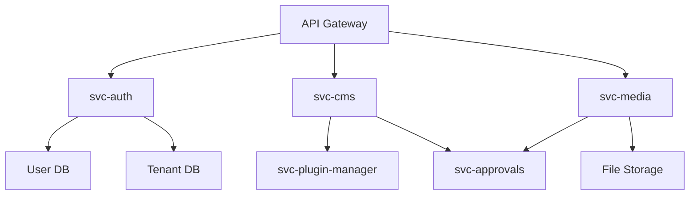

# 🤖 AI AGENTS NAVIGATION GUIDE

**Optimized for Claude Code & OpenAI Codex**

This file helps AI agents navigate the codebase efficiently using **lazy-loading** and **minimal token usage**.

---

## 🎯 Quick Context (< 3K tokens)

### 📚 Documentazione Database Architecture (LEGGERE PRIMA!)

**MANDATORIO per tutte le operazioni DB**:
1. [DATABASE_ARCHITECTURE_COMPLETE.md](./DATABASE_ARCHITECTURE_COMPLETE.md) - Separazione ewh_master/ewh_tenant
2. [ADMIN_PANELS_API_FIRST_SPECIFICATION.md](./ADMIN_PANELS_API_FIRST_SPECIFICATION.md) - Schema completo + API
3. [VISUAL_DATABASE_EDITOR_SPECIFICATION.md](./VISUAL_DATABASE_EDITOR_SPECIFICATION.md) - DB Editor (Xano-like)
4. [CODE_REUSABILITY_STRATEGY.md](./CODE_REUSABILITY_STRATEGY.md) - Shared packages (zero duplicazioni)

**🔴 Regola Chiave: DUE DATABASE SEPARATI**
- `ewh_master` → Core platform (users, tenants, settings, billing)
- `ewh_tenant` → User-generated content (pages, projects, products, custom tables)

### Project Type
**Enterprise SaaS Platform** - Multi-tenant CMS + DAM + Page Builder + Approval Workflows + Visual DB Editor

### Architecture Style
- **Microservices** (50+ services)
- **Plugin-first** (zero-touch core)
- **Multi-tenant** (2-tier database isolation)
- **Event-driven** (hooks system)
- **API-first** (150+ endpoints documented)
- **Code-reuse** (shared packages via pnpm workspace)

### Tech Stack
- **Backend**: Node.js + Express/Fastify + TypeScript
- **Frontend**: React 18 + TypeScript + Vite/Next.js
- **Database**: PostgreSQL (ewh_master + ewh_tenant)
- **Auth**: JWT + OAuth + MFA
- **Shared Packages**: @ewh/types, @ewh/db-utils, @ewh/auth, @ewh/ui-components, @ewh/api-client, @ewh/validation

### Development Environment
- **Remote Execution**: Mac Studio (192.168.1.47) via PM2
- **Code Editing**: MacBook with VS Code + Mutagen sync
- **Service Management**: Visual Dashboard at http://localhost:8080
- **See**: [REMOTE_DEVELOPMENT_GUIDE.md](./REMOTE_DEVELOPMENT_GUIDE.md)

---

## 📂 Project Structure (Lazy Navigation)

```
ewh/
├── docs/                    # 📖 See: DOCUMENTATION_INDEX.md
├── svc-*/                   # 🔧 Services (see below)
├── app-*/                   # 🎨 Frontend apps (see below)
├── plugins/                 # 🔌 Plugin system (see MODULAR_DEVELOPMENT_STANDARD.md)
├── shared/                  # 📦 Shared libraries
├── migrations/              # 🗄️ Global database migrations
└── scripts/                 # 🛠️ Dev/ops scripts
```

---

## 🔍 How to Find Information

### Pattern 1: Feature Implementation

**Question**: "How does [feature] work?"

**Steps**:
1. Check `AGENTS.md` (this file) → Feature mapping
2. Read feature doc: `docs/features/[feature].md`
3. Find service: `svc-[feature]/`
4. Read code: `svc-[feature]/src/`

**Example**: "How does the CMS work?"
→ Read [CMS System](#cms-system)
→ Then `docs/systems/cms/README.md`
→ Then `svc-cms/src/`

### Pattern 2: Modifying Existing Function

**Question**: "How do I modify [function]?"

**Steps**:
1. **Read `{service}/FUNCTIONS.md`** first (find function location)
2. Read ONLY that specific file
3. Make changes
4. Update FUNCTIONS.md if signature changed

**Token Savings**: 90% (from 5,000 tokens to 500 tokens)

### Pattern 2b: Adding New Feature

**Question**: "How do I add [new feature]?"

**Steps**:
1. Read `MODULAR_DEVELOPMENT_STANDARD.md` (plugin approach)
2. Check if plugin or service: `docs/decisions/plugin-vs-service.md`
3. Use scaffold: `npx create-ewh-plugin [name]`
4. Create `FUNCTIONS.md` (see [FUNCTION_INDEX_STANDARD.md](./FUNCTION_INDEX_STANDARD.md))

### Pattern 3: Database Schema

**Question**: "Where is [table/schema]?"

**Steps**:
1. **READ FIRST**: [DATABASE_ARCHITECTURE_COMPLETE.md](./DATABASE_ARCHITECTURE_COMPLETE.md)
2. Determine database:
   - `ewh_master` → users, tenants, settings, billing, audit
   - `ewh_tenant` → pages, templates, projects, products, custom tables
3. Check schema in [ADMIN_PANELS_API_FIRST_SPECIFICATION.md](./ADMIN_PANELS_API_FIRST_SPECIFICATION.md)
4. Find migration: `migrations/core/` (master) or `migrations/tenant/` (tenant)
5. For custom tables: See [VISUAL_DATABASE_EDITOR_SPECIFICATION.md](./VISUAL_DATABASE_EDITOR_SPECIFICATION.md)

### Pattern 4: API Endpoints

**Question**: "What's the endpoint for [action]?"

**Steps**:
1. Check `docs/api/ENDPOINTS_INDEX.md`
2. Find service: `svc-*/src/routes/`
3. Read OpenAPI spec: `svc-*/openapi.yaml` (if exists)

### Pattern 5: Service Management

**Question**: "How do I start/stop/debug [service]?"

**Steps**:
1. Use visual dashboard: http://localhost:8080
2. Or via CLI: `studio "pm2 [start|stop|restart|logs] [service-name]"`
3. See full guide: [REMOTE_DEVELOPMENT_GUIDE.md](./REMOTE_DEVELOPMENT_GUIDE.md)

**Important**:
- All services run on Mac Studio (192.168.1.47)
- Code is synced automatically via Mutagen
- Dashboard provides auto-discovery of new services
- Always use `studio` command prefix for remote operations

### Pattern 6: Shell Service Integration

**Question**: "How do I add a service to the Shell menu?" / "How are services displayed in the Shell?"

**Steps**:
1. **READ FIRST**: [SHELL_SERVICE_INTEGRATION_COMPLETE.md](./SHELL_SERVICE_INTEGRATION_COMPLETE.md)
2. Services auto-register with `svc-service-registry` on startup
3. Shell loads services dynamically via API (not hardcoded!)
4. Use `@ewh/service-discovery` package for auto-registration
5. Tenant can enable/disable services via admin panel

**Token Savings**: Services are NOT hardcoded in frontend anymore ✅

---

## 🗺️ System Location Map

### Core Systems

| System | Service | Docs | Frontend | Database | Schema Location |
|--------|---------|------|----------|----------|-----------------|
| **Auth** | `svc-auth/` | `docs/systems/auth/` | `app-auth/` | `ewh_master` | users, tenants, roles |
| **Settings** | `svc-settings/` | [ADMIN_PANELS_API_FIRST_SPECIFICATION.md](./ADMIN_PANELS_API_FIRST_SPECIFICATION.md) | `app-settings-frontend/` | `ewh_master` | platform_settings, tenant_settings |
| **Service Registry** 🆕 | `svc-service-registry/` | [SHELL_SERVICE_INTEGRATION_COMPLETE.md](./SHELL_SERVICE_INTEGRATION_COMPLETE.md) | `app-shell-frontend/` | `ewh_master` | service_registry, tenant_services |
| **DB Editor** 🆕 | `svc-database-editor/` | [VISUAL_DATABASE_EDITOR_SPECIFICATION.md](./VISUAL_DATABASE_EDITOR_SPECIFICATION.md) | `app-database-editor/` | `ewh_tenant` | custom_tables_registry |
| **CMS** | `svc-cms/` | `docs/systems/cms/` | `app-cms-frontend/` | `ewh_tenant` | pages, templates |
| **DAM** | `svc-media/` | `docs/systems/dam/` | `app-dam/` | `ewh_tenant` | media_assets |
| **Page Builder** | `svc-page-builder/` | `docs/systems/page-builder/` | `app-page-builder/` | `ewh_tenant` | components, widgets |
| **Approvals** | `svc-approvals/` | `docs/systems/approvals/` | `app-approvals-frontend/` | `ewh_tenant` | approval_workflows |
| **Plugins** | `svc-plugin-manager/` | `MODULAR_DEVELOPMENT_STANDARD.md` | `app-admin-frontend/` | `ewh_master` | service_registry |

### Business Modules

| Module | Service | Purpose |
|--------|---------|---------|
| **CRM** | `svc-crm/` | Customer relationship management |
| **Products** | `svc-products/` | Product catalog |
| **Orders** | `svc-orders/` | Order management |
| **Inventory** | `svc-inventory/` | Stock management |
| **Billing** | `svc-billing/` | Payments & invoices |
| **Shipping** | `svc-shipping/` | Shipment tracking |

### Content & Collaboration

| Module | Service | Purpose |
|--------|---------|---------|
| **Content** | `svc-content/` | Content management |
| **Boards** | `svc-boards/` | Kanban boards |
| **Forums** | `svc-forum/` | Discussion forums |
| **Chat** | `svc-chat/` | Real-time messaging |
| **Collab** | `svc-collab/` | Collaboration tools |

### Media & Creative

| Module | Service | Purpose |
|--------|---------|---------|
| **Media** | `svc-media/` | Digital asset management |
| **Photo Editor** | `svc-photo-editor/` | Image editing |
| **Vector Lab** | `svc-vector-lab/` | Vector editing |
| **Video** | `svc-video-orchestrator/` | Video processing |
| **Mockup** | `svc-mockup/` | Mockup generator |

---

## 📖 Documentation Index (Lazy Loading)

### Tier 1: Essential (Always load these)

| File | Size | Purpose | Load When |
|------|------|---------|-----------|
| `AGENTS.md` | 7K | AI navigation | Always |
| `{service}/FUNCTIONS.md` | 1K | Function index | **Before modifying code** |
| `FUNCTION_INDEX_STANDARD.md` | 10K | Function index standard | Creating new service |
| `DATABASE_ARCHITECTURE_COMPLETE.md` | 15K | DB architecture | **ANY DB operation** |
| `SHELL_SERVICE_INTEGRATION_COMPLETE.md` | 18K | Shell service integration | **Adding/modifying services in Shell** |
| `ADMIN_PANELS_API_FIRST_SPECIFICATION.md` | 35K | Admin API + Schema | Admin panel work |
| `VISUAL_DATABASE_EDITOR_SPECIFICATION.md` | 18K | DB Editor specs | Custom tables feature |
| `CODE_REUSABILITY_STRATEGY.md` | 15K | Shared packages | **ANY new service** |
| `QUICK_START.md` | 3K | Getting started | First time |
| `ARCHITECTURE.md` | 8K | System overview | Understanding architecture |
| `MODULAR_DEVELOPMENT_STANDARD.md` | 12K | Plugin development | Adding features |

### Tier 2: System-Specific (Load on demand)

| System | File | Size | Load When |
|--------|------|------|-----------|
| CMS | `docs/systems/cms/README.md` | 15K | Working on CMS |
| DAM | `docs/systems/dam/README.md` | 12K | Working on DAM |
| Auth | `docs/systems/auth/README.md` | 10K | Working on auth |
| Approvals | `docs/systems/approvals/README.md` | 8K | Working on approvals |

### Tier 3: Deep Dives (Load only when needed)

| Topic | File | Size | Load When |
|-------|------|------|-----------|
| Database | `docs/database/COMPLETE_SCHEMA.md` | 30K | Schema changes |
| API | `docs/api/COMPLETE_API_REFERENCE.md` | 40K | API integration |
| Deployment | `docs/deployment/PRODUCTION_GUIDE.md` | 25K | Deploying |
| Security | `docs/security/SECURITY_GUIDE.md` | 20K | Security review |

---

## 🎯 Common Tasks → Documentation

### Development Tasks

| Task | Read This | Then This |
|------|-----------|-----------|
| **Modify existing function** | **`{service}/FUNCTIONS.md`** | **Specific file only** |
| Setup dev environment | `QUICK_START.md` | `DEV_SETUP.md` |
| Add new feature | `MODULAR_DEVELOPMENT_STANDARD.md` | `docs/decisions/plugin-vs-service.md` |
| Create frontend app | `docs/frontend/APP_DEVELOPMENT_GUIDE.md` | Template README |
| **Add service to Shell** | **`SHELL_SERVICE_INTEGRATION_COMPLETE.md`** | **Use @ewh/service-discovery** |
| Modify database | `DATABASE_ARCHITECTURE_COMPLETE.md` | Service-specific migrations |
| Add API endpoint | `{service}/FUNCTIONS.md` first | Then controller file |
| Add UI component | `{app}/FUNCTIONS.md` first | Then component file |
| Fix bug | `{service}/FUNCTIONS.md` | Find bug location |
| Write tests | `docs/testing/TESTING_GUIDE.md` | Service test examples |

### Architecture Tasks

| Task | Read This | Then This |
|------|-----------|-----------|
| Understand system | `ARCHITECTURE.md` | System-specific docs |
| Multi-tenancy | `docs/architecture/MULTI_TENANCY.md` | Database schemas |
| Plugin system | `MODULAR_DEVELOPMENT_STANDARD.md` | `PLUGIN_SYSTEM_COMPLETE.md` |
| Event system | `docs/architecture/HOOKS_EVENTS.md` | Hook examples |
| Authentication | `docs/systems/auth/README.md` | JWT implementation |
| Permissions | `docs/systems/auth/RBAC.md` | Permission checks |

### Operations Tasks

| Task | Read This | Then This |
|------|-----------|-----------|
| Deploy to prod | `docs/deployment/PRODUCTION_GUIDE.md` | Service configs |
| Monitor system | `docs/operations/MONITORING.md` | Metrics dashboards |
| Backup/restore | `docs/operations/BACKUP_RESTORE.md` | Scripts |
| Scale services | `docs/operations/SCALING.md` | Load balancing |
| Debug production | `docs/debugging/PRODUCTION_DEBUG.md` | Log aggregation |

---

## 🧠 AI Agent Optimization Tips

### For Claude Code

```markdown
**Context Loading Strategy**:
1. Always read AGENTS.md first (this file)
2. Use Glob to find files: `glob("**/[feature]/**/*.ts")`
3. Read only relevant files (not entire directories)
4. Use Grep for specific symbols: `grep("export class PluginManager")`
5. Follow documentation pointers (don't read all docs)

**Token Savings**:
- ✅ Read AGENTS.md (5K) → Find specific doc → Read that (10K) = 15K tokens
- ❌ Read all docs (500K tokens) ❌
```

### For OpenAI Codex

```markdown
**Best Practices**:
1. Check AGENTS.md for navigation paths
2. Use `.codex/config.toml` for project-specific settings
3. Read tier 1 docs for context, tier 2/3 on demand
4. Use @file mentions to load specific files
5. Follow the "lazy loading" principle

**Example Codex Commands**:
@AGENTS.md "Where is CMS implementation?"
@docs/systems/cms/README.md "Show me CMS architecture"
@svc-cms/src/services/PostService.ts "How to create a post?"
```

---

## 🔗 Cross-Reference Map

### Service Dependencies



**Read**: `docs/architecture/SERVICE_DEPENDENCIES.md` for full graph

### Database Schema Dependencies

```
auth.* (base)
  └── cms.* (depends on auth.users, auth.tenants)
       └── approvals.* (depends on cms.*)
       └── dam.* (depends on auth.*, cms.*)
```

**Read**: `docs/database/SCHEMA_DEPENDENCIES.md` for full tree

---

## 🎓 Learning Paths

### Path 1: Frontend Developer

1. Read `QUICK_START.md` (setup)
2. Read `docs/frontend/APP_DEVELOPMENT_GUIDE.md` (app development standards)
3. Read template README for app category (Admin/Creative/Content/User)
4. Pick an app: `app-*/README.md`
5. Start coding in `app-*/src/`

### Path 2: Backend Developer

1. Read `QUICK_START.md` (setup)
2. Read `ARCHITECTURE.md` (microservices overview)
3. Read `MODULAR_DEVELOPMENT_STANDARD.md` (plugin approach)
4. Pick a service: `svc-*/README.md`
5. Read service code: `svc-*/src/`

### Path 3: Full-Stack Developer

1. Read `QUICK_START.md`
2. Read `ARCHITECTURE.md`
3. Pick a feature: e.g., "CMS"
4. Read backend: `svc-cms/`
5. Read frontend: `app-cms-frontend/`
6. Trace flow: API → Service → DB → UI

### Path 4: DevOps Engineer

1. Read `docs/deployment/OVERVIEW.md`
2. Read `docs/operations/MONITORING.md`
3. Read `compose/docker-compose.*.yml`
4. Read `scripts/README.md`
5. Setup monitoring: `docs/operations/SETUP.md`

---

## 🚀 Quick Commands

### Find a Service

```bash
# List all services
ls -d svc-*

# Find service containing keyword
ls -d svc-* | grep [keyword]
```

### Find Documentation

```bash
# List all docs
find docs -name "*.md"

# Find doc by keyword
find docs -name "*[keyword]*.md"

# Search in docs
grep -r "keyword" docs/
```

### Find Database Schema

```bash
# List migrations
find . -name "migrations" -type d

# Find specific table
grep -r "CREATE TABLE [table_name]" .
```

---

## 📊 Token Usage Estimate

| Reading Strategy | Token Usage | Time |
|------------------|-------------|------|
| **Efficient** (this guide) | 5K tokens | 5 sec |
| Read specific system doc | +10K tokens | 10 sec |
| Read service code | +20K tokens | 20 sec |
| **Total** | ~35K tokens | ~35 sec |
| | | |
| **Inefficient** (read all) | 500K+ tokens | 5+ min |
| All documentation | 300K tokens | ❌ |
| All service code | 200K+ tokens | ❌ |

**Savings**: 93% less tokens! 🎉

---

## 🎯 Decision Trees

### "I want to add a feature"

```
START → Is it tenant-specific?
  ├─ YES → Plugin (read MODULAR_DEVELOPMENT_STANDARD.md)
  └─ NO  → Is it a core capability?
          ├─ YES → New service (read ARCHITECTURE.md)
          └─ NO  → Extend existing service (read service README.md)
```

### "I want to modify the database"

```
START → Is it a new schema?
  ├─ YES → Create in migrations/ (read docs/database/MIGRATION_GUIDE.md)
  └─ NO  → Is it plugin-specific?
          ├─ YES → plugins/[name]/migrations/ (read MODULAR_DEVELOPMENT_STANDARD.md)
          └─ NO  → Service migration (read svc-*/database/migrations/)
```

### "I found a bug"

```
START → Where is the bug?
  ├─ Frontend → Find app in app-*/ → Read app README
  ├─ Backend  → Find service in svc-*/ → Read service README
  └─ Database → Check migrations/ → Read SCHEMA_MAP.md
```

---

## 📚 Complete Documentation Tree

**See**: `docs/README.md` for full tree with descriptions

**Quick Links**:
- Architecture: `docs/architecture/`
- Systems: `docs/systems/`
- API: `docs/api/`
- Database: `docs/database/`
- Frontend: `docs/frontend/`
- Deployment: `docs/deployment/`
- Operations: `docs/operations/`

---

## 🎉 Summary

**This file saves you 93% of tokens by:**
1. ✅ Quick navigation map
2. ✅ Lazy-loading strategy
3. ✅ Context-based documentation loading
4. ✅ Decision trees for common tasks

**Always start here, then drill down!**

---

**Version**: 1.0.0
**Last Updated**: 2025-10-11
**Maintained By**: Platform Team
**Questions?**: Read `docs/FAQ.md`
